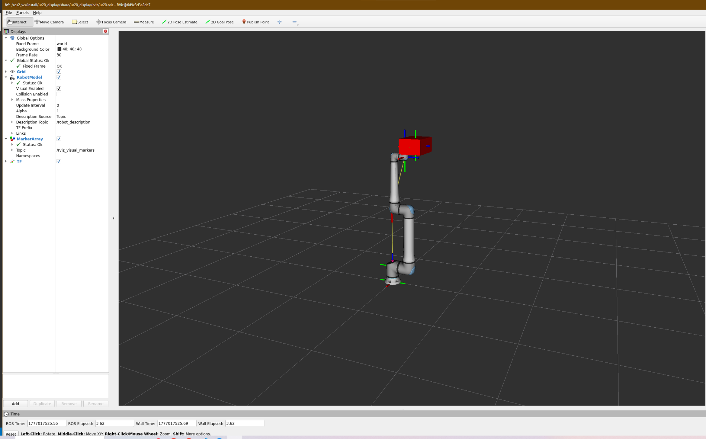

# Robotics Software Engineer Technical Assessment
This project is a technical assessment for a position in Progressive Robotics. It is divided in three main steps.

## Step 1: Development Environment with Docker
The first step is to set up the development environment required to run the ROS2 software pipeline. Since ROS2 Humble is mainly for Ubuntu 22.04, and the project needs to remain portable across different operating systems, Docker is used to provide a consistent and reproducible development environment.

### Docker
Docker is a containerization software that creates an isolated environment called container, packaging all dependencies required by the application. To begin, Docker Desktop, must be installed if not already in the system, the link: "https://www.docker.com/products/docker-desktop/". After installing the app, two necessary files are needed. 

The first file is the Dockerfile and it contains commands for building the ready to run system with the preferable OS and all the packages needed to run the project from anywhere.

The second file is the docker-compose.yml, the yml file acts as the orchestration of the system. It specifies what images,  are required, ports that need to be exposed, communication and acces to the host systems, such as file system, and so on.

### How to Run
After writing the two files for the system, the build command builds the image:

```bash
docker compose build
```

After successfully building the image, in order to start the container and run to the background:

```bash
docker compose up -d
```
To verify the container is running:
```bash
docker ps
```
Last necessary command that launches a shell inside the container:
```bash
docker exec -it <container_name> /bin/bash
```

### Troubleshooting
Because the Docker builds an image on Windows, it runs inside a lightweight Linux VM managed by Docker Desktop. That VM sometimes uses Windows' DNS setting, which can be misconfigured through a different DNS resulting to random 'Bad Request' errors when trying to download packages. The fix was to explicitly tell Docker to use a public DNS server instead of the system default.
In the system settings->Docker Engine of Docker Desktop:
```json
  "dns": [
    "8.8.8.8",
    "1.1.1.1"
  ],
```
This network issue was diagnosed with the assistance of an LLM during debugging.

## Step 2: Linear Algebra 
The second part of the project, is the implementation of a Least Squares calculator for the solution of `||Ax-b||` with the use of multiple nodes communication, services and other ros2 tools such as publish/ subscription. The second part is split into 3 different parts of a system. 

### Service
The service is the communication architect of the system, it creates the port for the nodes two speak and what types of messages will the share.

### Client Node
The client node acts as a slave in a master - slave behavior of the system. It loads the data from the outside source, the yaml file, after loading the data it send them to the server node to solve the equation and waits back a response. The response comes as three messages, the transformed x, and the two tools that used for the transformation in order to then proceed and invert back the transformed x and find the correct solution.

The request/ response are implemented in the `send_request` function that sends the message of the matrix and the vector. Uppon sending a request with `async_send_request` it waits for a response that will contain the the transformed `x`, and the matrix and vector for the transformation. Finaly it publish the solution as a message in the new topic in order for any node to subscribe and see the solution.

The recovery for the final solution of x is happening in `invert_model` and it solves the simple equation `x=R^-1(x'-t)` and returns the x vector.

Further functions have been implemented for logging and debugging the system.

### Server Node
The server node has two jobs, it get the matrix and vector from the client request and calculates the least squared solution with the use of eigen library. After the solution it transforms the vector and send back the transformed vector and the data that transformed it. At the same time it creates a thread that awaits for the published data from the client in order to subscribe those data pass it to the thread in order to print them. 

The `find_least_squares_solution` is the callback function that gets the request and solve the equation and sends back the message to the client.

The `transformed_vector_callback` is the callback function that notifies the conditional variable in order to pass the message to the thread with a pointer and to unlock the mutex for the thread.

The `worker_thread_function` awaits the conditional variable to unlock the mutex lock and logg the message that subscribed from the topic. After it loggs the message it locks again and waits until a future message is arrived.

### How  to build and run
The ros2 nodes and services act as separate programms each that communicate with each other, thats why they are build as separate packages. 
```bash
ros2 pkg create <package_name> --build-type ament_cmake
```
where package_name is the preferable name of the package. 

This command creates a package with this structure 
|── <package_name>/
    |── CMakeLists.txt
    |── package.xml
    |── src/
The problem is that this is the structure for the conventional packages for the nodes. For the service package, it needs to be in a srv dir so the src needs to be modified.

For each package the CmakeLists.txt and the package.xml needs to be modified in order to add any dependencies, link libraries and have instructions for how to compile and run the system.

For the nodes the files inside the src are .cpp, .hpp and are the backend programms. For the service it should be a .srv file and initialize the response and request messages.

After implementing all the necessery components, the packages needs to be build: 

```bash
colcon build --packages-select <package_name1> <package_name2> ... 
```
If it builds succesfully, it is necessery to source the workspace if it isn't already from the Docker image:
```bash
source install/setup.bash
```
Then in two seperate workspace terminals, one for each node:

```bash
ros2 run <package_name> <node_name> 
```
The logging in the terminals show the messages that the two nodes share, for further check in the system the topic that is created for the publisher can be reviwed from a outside workspace, from a new terminal after it has been sourced:

```bash
ros2 topic list
``` 
It shows the topic that exists between the nodes

```bash
ros2 topic info <topic_name>
```
It shows information about the given topic

```bash
ros2 topic echo <topic_name>
```
It flashes in the screen the message.

## Step 3: URDF Visualization and Robot State Control
The third part of the project focuses on loading a robot model, controlling its joint states, and visualizing its motion and transformations in RViz using ROS2 tools.

### URDF Integration and Robot Description
The UR20 robot model is described using a URDF file, which defines the links, joints, and kinematic structure of the robot. The URDF is extended using a Xacro file `ur20_with_gripper.urdf.xacro` to attach a custom box gripper at the end-effector.

The robot description is loaded through the launch file and passed as a parameter to the `robot_state_publisher` node.

The UR20 URDF is included as a git submodule. After cloning the repo:
```bash
git submodule update --init --recursive
```
The `ur20_display_node` is responsible for driving the robot motion. It publishes joint states to the /joint_states topic, which is then used by `robot_state_publisher` to compute forward kinematics and update the TF tree.

### Display Node

The ur20_display_node.cpp is the main control node of this step.

It:

- Reads joint values from parameters
- Publishes joint states to /joint_states
- Generates a smooth sinusoidal trajectory to a target configuration
- Publishes the full trajectory for plotting
- Reads TF transforms to verify kinematic relationships

The sinusoidal trajectory ensures smooth motion without abrupt changes in velocity.

In the constructor it initializes the full ROS2 node infrastructure, it declares and retrives the initial parameters from a yaml file `/config/joint_config.yaml` , setup `the rviz_visual_tools` andthe necessery publishers and threads.

The `initial()` function initializes the robot in the required L-shaped configuration by repeatedly publishing joint states until the TF tree becomes available, this step resolves a common ROS2 issue where TF transforms are not immediately available at startup, and it ensures that the robot is correctly visualized in RViz before any TF queries are performed.

The node uses two main callback functions to handle TF monitoring and robot motion:

`tf_timer()`

This function runs periodically using a ROS2 timer and is responsible for TF monitoring and visualization.
The node verifies the correctness of the transformations by checking the relationship:

$T_{world→gripper} = T_{world→elbow} ⋅ T_{elbow→gripper}$

This confirms that the TF tree is consistent and that the forward kinematics are correctly computed.

`run_trajectory()`

This function runs in a separate thread and is responsible for generating and executing robot motion. for bonus1 and bonus2. It generates a periodic sinusoidal trajectory between the initial position `q0` and `qf` The trajectory is computed as:
$q(t)= q_0 + (q_f - q_0) ⋅ 0.5 ⋅ (1-cos(2⋅π⋅t/ T))$

After that it publishes to `sensor_msgs/msg/JointState` for real-time robot animation and to `trajectroy_msgs/msg/JointTrajectroy` where a node from a python script subscribes to the topic and visualize the trajectroy plots for every joint with matplotlib.

### Visulization
RViz is used to visualize the robot model in real time, the gripper frame and additional markers and labels using `rviz_visual_tools`. Also the `trajectory_plotter.py` node subscribes to the trajectory topic and plots joint values over time using matplotlib. This helps verify smoothness and correctness of the generated motion.

### Dependencies

The package depends on the following ROS2 components:

- `rclcpp`
- `sensor_msgs`
- `trajectory_msgs`
- `tf2_ros`
- `geometry_msgs`
- `rviz_visual_tools`
- `Eigen3`

These dependencies are declared in the CMakeLists.txt and package.xml files and are required for building and running the node.
### Display setup (required for visualization)
VcXsrv must be running on Windows with "Disable access control" enabled.
Download from: https://sourceforge.net/projects/vcxsrv/
In case there is an issue with the visualization a simple solution is to connect the virtual display with the actual manualy
Find your Windows IP:
```powershell
ipconfig
```
Set the DISPLAY variable:
```bash
export DISPLAY=<your-windows-ip>:0.0
```

### Command to launch
```bash
ros2 launch ur20_display display.launch.py
```
Or for the bonus, to run the trajectory and the parallel plotting

```bash
ros2 launch ur20_display display.launch.py trajectory:=true
```
### Package structure
The `ur20_display` package contains:
- `urdf/ur20_with_gripper.urdf.xacro` — UR20 URDF with custom box gripper attached to flange
- `src/ur20_display_node.cpp` — C++ node that:
- `scripts/trajectory_plotter.py` — Python node that plots joint trajectories via matplotlib
- `launch/display.launch.py` — launches all components
- `rviz/ur20.rviz` — pre-configured RViz 
- `screnshot/L_position_step3` - screenshot for the step 3 objective
 
### Screenshot


## Summary

This project demonstrates a complete ROS2 pipeline including:

Containerized development environment
Distributed computation using services and nodes
Robot modeling and TF-based kinematics
Real-time visualization and trajectory generation

The system is designed to be modular, reproducible, and extensible, following standard ROS2 development practices.
